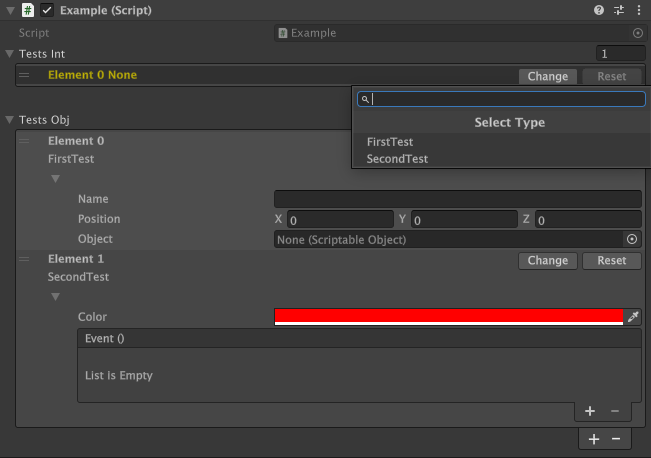

# SerializeReference Type Filter

Safe and production-ready Inspector UX for polymorphic `[SerializeReference]` fields in Unity.

This package provides a searchable, AddComponent-like dropdown for selecting concrete implementations of interfaces or base classes stored via `[SerializeReference]`, while strictly respecting Unity’s serialization constraints.

---

## Features

- ✅ Searchable dropdown with keyboard navigation (AddComponent-style)
- ✅ Type filtering by interface or base class
- ✅ Stable Inspector behavior (no crashes, no native warnings)
- ✅ Protection against unsupported types (`struct`, `UnityEngine.Object`)
- ✅ Works with Undo / Prefabs / Domain Reload
- ✅ Editor-only, zero runtime overhead
- ✅ No reflection hacks into internal EditorWindow APIs

---

## Important Unity Constraints

> These are **engine-level limitations**, not package limitations.

`[SerializeReference]` **does NOT support**:

- `struct` (value types)
- `ScriptableObject`
- `MonoBehaviour`
- Any type deriving from `UnityEngine.Object`

Attempting to assign such types will result in:
- `InvalidOperationException`, or
- A broken Inspector state

This package:
- Prevents unsupported types from appearing in the dropdown
- Detects invalid serialized data
- Displays a warning and provides a safe **Reset** option

---

## Installation

1. Open **Unity → Edit → Project Settings → Package Manager**
2. Click **Add package from git URL…**
3. Enter:

```
https://github.com/yourcompany/serialize-reference-typefilter.git
```

---

## Requirements

- Unity **2021.3 LTS** or newer
- Editor-only usage
- Familiarity with `[SerializeReference]`

---

## Usage

### Declaring a field

```csharp
[SerializeReference, TypeFilter(typeof(IMyInterface))]
public IMyInterface Context;
```

Where:
- `IMyInterface` is an interface or abstract base class
- All implementations must be:
    - `class`
    - non-abstract
    - **NOT** derived from `UnityEngine.Object`

---

## Inspector Behavior

### Header Layout (Important)

The Inspector header follows **Unity conventions**:

- **Title** → field name (`property.displayName`)
- **Details** → selected concrete type

Example:



This ensures:
- Stable UI (header does not change when implementation changes)
- Clear separation between **contract** (field) and **implementation** (type)

---

### Controls

- **Change** → opens searchable dropdown
- **Reset** → clears the reference
- Inline fields → shown only for valid managed types

---

## Inspector States

| State | Description |
|------|-------------|
| **Empty** | No value assigned |
| **Valid** | Supported managed reference |
| **Unsupported** | `struct` or `UnityEngine.Object` detected |

### Unsupported State

If unsupported data is encountered (for example from legacy serialization or a merge):

- The Inspector does **not** crash
- A warning message is shown
- A **Reset** button allows safe recovery

---

## Architecture Overview

### `TypeFilterAttribute`

Defines the base type used for filtering available implementations.

```csharp
[SerializeReference, TypeFilter(typeof(IMyInterface))]
```

---

### `SerializeReferenceTypeDropdown`

A custom `AdvancedDropdown` responsible for:

- Discovering compatible types via `TypeCache`
- Filtering out unsupported candidates
- Rendering the searchable dropdown UI

No reflection access to internal Unity editor windows is used.

---

### `SerializeReferenceAdvancedDropdown`

A static launcher that:

- Manages `AdvancedDropdownState`
- Ensures stable UX across multiple openings
- Does not affect serialization or stored data

---

### `TypeFilterDrawer`

A custom `PropertyDrawer` that:

- Renders the Inspector header and controls
- Validates current values
- Prevents Inspector crashes
- Displays warnings and recovery options

---

## Why UnityEngine.Object Is Not Supported

Short explanation:

- `[SerializeReference]` stores **pure managed object graphs**
- `UnityEngine.Object` instances are **native engine-backed objects**
- Unity explicitly forbids mixing these two models

This is a **hard engine limitation**.

If you need asset references:
- Use a separate `UnityEngine.Object` field, or
- Implement a dedicated wrapper/container architecture (out of scope for this package)

---

## Recommended Use Cases

### ✔ Use this when:
- You need polymorphic logic
- Implementations are pure C# classes
- Inspector stability matters

### ❌ Do not use this when:
- You need to store assets or scene objects
- You rely on `ScriptableObject` polymorphism
- You want a single field to store both managed and Unity objects

---

## Common Mistakes

### ❌ Including ScriptableObject types
Not supported by Unity. Will throw exceptions.

### ❌ Bypassing checks via reflection
Leads to unstable Editor behavior and native warnings.

### ❌ Mixing managed and Unity objects in one field
Requires a different data model.

---

## Summary

This package provides a **safe, production-ready solution** for polymorphic `[SerializeReference]` fields with a modern Inspector UX.

It:
- Respects Unity’s serialization rules
- Prevents invalid states
- Avoids undefined behavior
- Makes limitations explicit instead of hiding them

If you need support for both managed objects and `UnityEngine.Object`, that requires a **separate hybrid architecture**, intentionally outside the scope of this package.

---

**Status:** Stable  
**Scope:** Editor-only  
**Design goal:** Correctness over hacks

